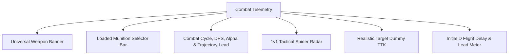
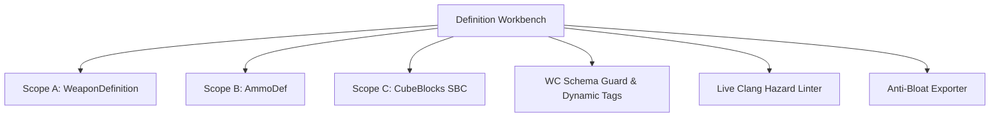
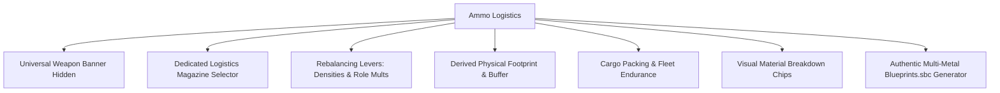

# GVK Weapon Studio — Architecture & Technical Design Document

> **Status**: Active Reference Document  
> **Repository**: `GV-Server-Mods/GVK-Weapons-Pack`  
> **Directory**: `docs/`  
> **Primary Maintainer**: GVK Modding & Systems Engineering Pair Programming  
> **Live Tool**: Open [`docs/index.html`](file:///C:/Users/blayl/OneDrive/Documents/Space%20Engineers/MDK2%20Mods/GVK_Weapons/docs/index.html) or run `run_studio.bat`

---

## 1. Mission & Architectural Philosophy

The **GVK Weapon Studio** is an offline-capable, zero-dependency browser-based engineering station and combat telemetry suite for the *GV: Deserts of Kharak* Space Engineers server. It bridges the gap between raw WeaponCore C# scripts (`CoreParts/`), Keen XML definitions (`CubeBlocks_*.sbc`, `Blueprints.sbc`), and live gameplay balance.

### Core Architectural Tenets
1. **Zero External Framework Bloat**:
   - Built entirely in native modern HTML5, CSS3 (using CSS custom properties / design tokens), and vanilla ES6+ JavaScript.
   - Zero `npm`, Node.js, or webpack build pipelines required. Runs identically whether launched via a local `file:///` URI or hosted via GitHub Pages / HTTP static server.
2. **Dual Audience UX**:
   - **Combat Telemetry (Workspace 1)**: Player-facing tactical station. Instant readouts, 1v1 radar comparisons, time-to-kill against armor/modules, and drifting rover lead calculations.
   - **Definition Workbench (Workspace 2)**: Deep modder station. Form-based editing of all WeaponCore C# struct tags, SBC component layers, dynamic schema inspector, and anti-bloat C# exporter.
   - **Ammo Logistics (Workspace 3)**: Fleet logistics and economy station. Automated damage/physical densities, cargo container fleet endurance, and authentic multi-metal blueprint generation.
3. **Engine-Accurate Ground Truth**:
   - Weapon, ammo, animation, and blueprint datasets are extracted directly from the mod's official source files (`CoreParts/`, `CubeBlocks_Weapons.sbc`, `Blueprints.sbc`, `AmmoMagazines_Ship.sbc`).
   - Calculations rigorously match Space Engineers / WeaponCore engine mechanics (60-tick combat cycles, recursive fragment/AoE damage, burst/reload cycles, and conveyor volume constraints).

---

## 2. Directory & Data Structure

```
GVK_Weapons/
├── docs/
│   ├── index.html                           # Single-page application shell & layout
│   ├── style.css                            # Complete styling, design tokens & light/dark theme engine
│   ├── app.js                               # Core controller, calculation engine & event handlers
│   ├── WEAPON_STUDIO_DESIGN_DOCUMENT.md     # This design document
│   ├── data/
│   │   ├── wc_schema.js                     # WeaponCore v0.75 structure & enum fingerprint
│   │   ├── weapons_data.js                  # 96 mod weapons bundled dataset
│   │   ├── ammos_data.js                    # 63 WeaponCore ammo rounds bundled dataset
│   │   ├── magazines_blueprints_data.js     # 19 official ammo magazines & authentic ingot blueprints
│   │   ├── animations_data.js               # 18 subpart animation definitions
│   │   ├── components_data.js               # Valid SE component definitions (ores filtered out)
│   │   ├── weapons_db.json                  # Standalone JSON database mirror
│   │   ├── ammos_db.json                    # Standalone JSON database mirror
│   │   └── components_db.json               # Standalone JSON database mirror
│   └── icons/                               # High-res weapon & ammo DDS-converted PNG icons
└── run_studio.bat                           # 1-click launcher for Windows pair programming
```

---

## 3. The Three Workspaces

### Workspace 1: ⚔️ Combat Telemetry & Benchmarks (`#ws-telemetry`)
*Default landing view for all users.*



#### 1. Universal Weapon Banner & Badges
- **Active Weapon Icon & Dropdown**: Large weapon icon with orange border (`#d97706`). Dropdown separated into *Player Standard Armaments* and *⚔️ NPC / Relic / Enemy Armaments*.
- **Dynamic GVK Status Badges**:
  - `[ ⚡ X UPs ]`: Utility Points dynamically calculated from total Prototech component count (excluding Data Cores). Matches server Spec Core balancing.
  - `[ 👑 Relic Weapon ]` vs `[ ⚙️ Standard Production ]`: Automatically derived from blueprint ingredients (`GVK_RUs` or non-craftable scavenged items).
  - `[ 🔬 Circuitry: 1 (>2km) ]`: GVK rule gate ensuring any weapon engaging beyond $2\text{km}$ mandates `PrototechCircuitry`.
  - `[ 🛡️ Large Grid ]` / `[ 🏎️ Small Grid ]`.
  - `[ ⚔️ NPC Variant ]`: Flags non-player enemy armaments (e.g. Harbinger Cruiser, Gaalsien Raiders).

#### 2. Loaded Munition Selector Bar (`.telemetry-ammo-bar`)
- Positioned directly beneath the active weapon banner and **permanently visible across all weapons** (single-ammo and multi-ammo alike).
- Features matching orange border (`#d97706`), ammo magazine icon, and munition selector for dual-load weapons (e.g. High Explosive vs Armor Piercing).
- Live badges display munition role, total damage per shot, muzzle speed, and max range (armor-multiplier chips live exclusively in the matrix below).

#### 3. Recursive Damage Engine & Scalable TimedSpawns Architecture
Calculates true damage potential through multi-stage fragment trees:
$$\text{Total Lifetime Damage} = \text{BaseDamage} + \text{AreaOfDamage} + \sum_{\text{frags}} (\text{Count} \times \text{Damage}_{\text{child}})$$
- **Area of Damage (AoE)**: Evaluates both `ByBlockHit` (impact explosion) and `EndOfLife` (flak proximity burst). Excludes non-damaging EWAR effects.
- **Scalable TimedSpawns Delivery Duration ($\Delta T_{\text{delivery}}$)**:
  Evaluates `TimedSpawnDef` (`maxSpawns`, `groupSize`, `interval`, `groupDelay`):
  $$\text{numBursts} = \left\lceil \frac{\text{totalSpawns}}{\text{groupSize}} \right\rceil, \quad \Delta T_{\text{delivery}} = \frac{(\text{numBursts} - 1) \times \text{groupDelay} + \text{groupSize} \times \text{interval}}{60\text{ ticks/sec}}$$
- **Instantaneous Cluster vs Loitering Deployable Scaling**:
  - **If $\Delta T_{\text{delivery}} \le 1.0\text{s}$** (Flak, Proximity Warhead, Cluster Bomb):
    All fragments arrive in the initial strike:
    $$\text{AlphaRound} = \text{BaseDamage} + \text{AreaOfDamage} + (\text{totalSpawns} \times \text{ChildDamage})$$
    $$\text{AlphaVolley} = \text{AlphaRound} \times \text{BarrelsPerShot}$$
    $$\text{Sustained DPS} = \text{RPS} \times \text{TotalLifetimeDamage}$$
  - **If $\Delta T_{\text{delivery}} > 1.0\text{s}$** (Drones, Loitering Minefields, Area Denial):
    Initial burst contributes to opening salvo; sustained payload delivers over time:
    $$\text{AlphaRound} = \text{BaseDamage} + \text{AreaOfDamage} + (\min(\text{groupSize}, \text{totalSpawns}) \times \text{ChildDamage})$$
    $$\text{AlphaVolley} = \text{AlphaRound} \times \text{BarrelsPerShot}$$
    $$\text{LoiterDPS} = \frac{\text{TotalLifetimeDamage}}{\Delta T_{\text{delivery}}}$$
    $$\text{MaxConcurrent} = \min\left(\text{MagsToLoad}, \max\left(1.0, \frac{\Delta T_{\text{delivery}}}{\text{CycleSec}}\right)\right)$$
    $$\text{Sustained DPS} = \text{LoiterDPS} \times \text{MaxConcurrent}$$
  - Guarantees the **MAC Gun** ($2,000,001\text{ Alpha}$) remains the server's undisputed top Alpha weapon, while loitering summons (e.g. Falcon Drone at $45,001\text{ Alpha}$, $26,447\text{ DPS}$) scale realistically.

#### 4. Target Damage & Multiplier Matrix (`.target-matrix-card`)
Renders authentic weapon-to-target lethality across 4 key combat target profiles:
- **Heavy Armor**: Multiplier ($\text{e.g. } 3.0\times\text{ on AP, } 1.0\times\text{ on HE}$), effective shot damage ($\text{e.g. } 18,000\text{ hp vs } 12,000\text{ hp}$), and salvo volley. Highlights armor-shredding penetration.
- **Light Armor**: Multiplier ($\text{e.g. } 0.5\times\text{ on AP [over-penetration], } 1.0\times\text{ on HE}$), and effective damage.
- **Non-Armor (Systems)**: Multiplier ($\text{e.g. } 1.0\times\text{ on 155 AP, } 2.0\times\text{ WeaponCore default when unset}$) and effective damage against internal systems (batteries, refineries, thrusters, gyros).
- **Blast & Splash**: Detonation radius ($\text{e.g. } 4.0\text{m}$), blast damage ($6,000\text{ hp}$), and penetration depth ($4.0\text{m}$ Pooled).
- Row subtexts show salvo volley (plus the Overpen cap when present) only — the per-row multiplier badge already carries the shred/resist story.
- **Target Dummy Time-to-Kill (TTK)**: Applies true target multipliers ($\text{Damage}_{\text{target}} = \text{Base} \times \text{Multiplier} + \text{AoE} + \text{Frag}$) when simulating shots and time to destroy Light Armor, Heavy Armor, Battery, and Refinery cubes. Demonstrates why 155 AP destroys a Heavy Armor Cube in 1 salvo ($18\text{k dmg} > 16.5\text{k hp}$) while 155 HE requires 2 salvos.

> **Shieldless Migration Note**: The GVK server runs without shield mods, so all shield surfaces were removed from the Studio — matrix column, Workbench controls, WC C# exporter output, and minimal-def seeds. The **Non-Armor (Systems)** profile took the Shields slot in the matrix. WeaponCore's upstream shield fields remain in the reference source and bundled data, but are never displayed or emitted by this tool.

**Effective DPS (Best-Fit Target)** — raw paper DPS is pre-multiplier. The hero card's big number shows the round's peak ideal: the full sustained payload scaled by whichever armor multiplier is highest:
$$M_{\text{best}} = \max(\text{Heavy}, \text{Light}, \text{NonArmor}), \quad \text{Effective DPS} = \text{Sustained DPS} \times M_{\text{best}}$$
Unset multipliers ($-1$) resolve to $1.0\times$. The blue disclaimer beneath states where the multiplier bites — e.g. "Effective against Heavy Armor (×3.0) · Paper: X DPS" — preserving the raw figure; two-way ties join labels and all-equal rounds read "All Targets". The peak interpretation intentionally ignores the Overpen cap (the full payload does land on the grid, just spread across blocks) — per-block reality stays in the matrix volleys, TTK and 🪡 chip. The Alpha Volley hero follows the same best-fit theme (instant payload × $M_{\text{best}}$, paper volley in the blue disclaimer). Per the WeaponCore wiki, DamageScales armor modifiers multiply the projectile's BaseDamage (AreaEffect/Detonation carry their own damage types and are not documented as armor-scaled), which is the convention the matrix rows follow. The 1v1 radar and compare table use effective DPS and effective alpha volley for both weapons.

**Overpen (`BaseDamageCutoff`)** — per WeaponCore source, penetrating rounds apply at most Cutoff damage per block hit and carry the remainder onward:
$$D_{\text{block}} = \min(\text{BaseDamage}, \text{Cutoff}) \times M_{\text{target}}, \quad N_{\text{blocks}} = \left\lfloor \frac{\text{BaseDamage}}{\text{Cutoff}} \right\rfloor$$
- The cap **redistributes** damage, never destroys it: raw DPS and total alpha (e.g. the MAC's $2{,}000{,}001$) are unchanged.
- Matrix volleys and the TTK simulator use $D_{\text{block}}$ (a single cube cannot absorb the full base damage of a capped round); the matrix header shows a `🪡 Overpen: N blocks @ X hp` chip whenever `BaseDamageCutoff > 0` (it replaces the retired "Loaded" munition badge, which duplicated the munition bar).

#### 5. Effective Fire Rate & Combat Cycle
Replaces static heat bars with operational sustainability metrics:
- **Duty Cycle Percentage**: Real-time ratio of firing uptime vs reload downtime.
- **Consumption Rate**:
  - **Physical Munitions**: Computes exact magazine burn rate ($\text{mags/min}$).
  - **Energy Weapons**: For energy-draining systems, derives Uranium consumption ($\text{kg/min}$ based on $1\text{ MWh} = 1\text{ kg Uranium}$).

#### 6. Hexagonal Tactical Radar (`#radarCanvas`)
- Plots 7 normalized tactical axes dynamically scaled across the dataset:
  1. **DPS** (Sustained Damage Per Second)
  2. **Volley Alpha** (Single-shot burst payload)
  3. **Targeting Range** (Weapon's actual engagement range from `MaxTargetDistance`, **not** raw ammo flight trajectory)
  4. **Muzzle Velocity** (Projectile flight speed)
  5. **Tracking Rate** (Azimuth & Elevation traverse agility in deg/s)
  6. **Block Integrity** (Cube block durability)
  7. **Power Draw** (Operational power draw in MW — idle + sustained firing energy)
- **1v1 Benchmark Comparison**:
  - Active weapon in **Amber/Orange** (`#f59e0b`).
  - Benchmark weapon in **Cyan/Blue** (`#38bdf8`).
  - Outliers (such as the 200mm MAC and SRBM) scale naturally without clipping or special case filtering.
  - Side-by-side comparison card displaying active weapon name & description above benchmark weapon name & description.

#### 7. Tactical Tools
- **Initial D Flight Delay & Drift Lead**: Projects target intercept flight time at $500\text{m}$, $1000\text{m}$, and $\text{Max Range}$, and calculates dune drift lead at $100\text{ km/h}$ ($27.8\text{ m/s}$).
- **Target Dummy Time-to-Kill (TTK)**: Real-time simulation against Light Armor ($3\text{k HP}$), Heavy Armor ($16.5\text{k HP}$), Battery ($11.4\text{k HP}$), and Refinery ($37.3\text{k HP}$) with active damage scale modifiers applied.
- **🔗 Share Permalinks**: Encodes configuration state (`?gun=...&ammo=...&vs=...`) for instant Discord sharing.

---

### Workspace 2: 🔧 Definition Workbench (`#ws-workbench`)
*Deep modder configuration mirroring WeaponCore C# structures and Keen SBCs.*



#### 1. Scope A: `WeaponDefinition` Editor
Form controls categorized strictly matching the C# struct layout:
- `ModelAssignmentsDef` (Subtypes, dummy muzzles, elevation/azimuth subparts)
- `HardwareDef` (Elevation/Azimuth traverse rates, limits, idle power, offset)
- `LoadingDef` (RoF, barrels, reload ticks, burst delays, magazines to load)
- `HardPointDef` (Accuracy deviation, aiming tolerance, prediction, water fire)
- `TargetingDef` (Min/Max ranges, top targets/blocks, threat flags, subsystem targeting)
- `AiDef` & `UiDef` (Slave control, terminal sliders, guide toggles)
- `HardPointAudioDef` (Firing, reload, rotation, travel SFX)
- `OtherDef` (Part caps, energy priority, LOS checks)
- Multi-ammo assignments and 18 subpart animation controllers.

#### 2. Scope B: `AmmoDef` Editor
Full canonical WeaponCore round engineering:
- Header & Core (Base damage, cutoff, mass, health, kick force)
- `TrajectoryDef` & `SmartsDef` (Speed, acceleration, lifetime, pro-nav guidance, scan rates)
- `DamageScaleDef` (Armor & Non-Armor multipliers, grid scaling, falloff)
- `AreaOfDamageDef` (Impact `ByBlockHit` & Proximity `EndOfLife` explosive radii)
- `FragmentDef` (Child ammo round triggers, spawn counts, radial dispersion)
- `PatternDef`, `EwarDef`, `GraphicDef` (Tracers & ribbon trails), and `AmmoAudioDef`.

#### 3. Scope C: `CubeBlocks SBC` Editor & Standardizer
- **Enforced Vanilla AI Targeting Suppression**: Automatically enforces `<AiEnabled>false</AiEnabled>` to eliminate vanilla Keen turret lag loops.
- **Component Layers Recipe Editor**:
  - Filtered strictly to valid construction components (all raw ores and ingots suppressed except `GVK_CUs`).
  - Allows adjusting quantities, reordering layers, adding components, and deleting layers.
  - **Dynamic Build Time Calculation**:
    $$\text{BuildTime} = \max\left(5, \operatorname{round}\left(\frac{\text{WeaponIntegrity}}{\text{BuildTime\_Dividend}}\right)\right) \quad (\text{Default Dividend} = 750)$$
  - **Auto-Derived Prototech Tech Requirements**:
    Scans layers for Prototech items (`Machinery`, `Frame`, `Circuitry`, `Capacitor`, `Propulsion`), derives total UPs, and automatically verifies $>2\text{km}$ Circuitry rules.
- **Embedded Real-Time SBC Exporter**:
  - Displays formatted `<Definition xsi:type="MyObjectBuilder_WeaponBlockDefinition">` XML with syntax highlighting.
  - `📋 Copy SBC XML` and `💾 Download .sbc` buttons for immediate in-game testing.

#### 4. WeaponCore Schema Guard & Dynamic Tag Inspector
- Tracks `CoreParts/script/Structure.cs` fingerprint. If WeaponCore updates and introduces new structs or tags, the dynamic tag inspector auto-renders typed UI controls and losslessly serializes them into C#.
- **Lean Anti-Bloat Exporter**: Suppresses all default, zeroed, or inactive tags (e.g. disabled fragment blocks, zeroed offsets, unused audio), emitting clean C# code compliant with GVK anti-bloat rules.

---

### Workspace 3: 📦 Ammo Logistics & Blueprints (`#ws-logistics`)
*Automated magazine mathematics, fleet logistics, and authentic manufacturing recipes.*



#### 1. Workspace Isolation
- When switching to `#ws-logistics`, the universal weapon banner is automatically hidden to eliminate clutter and allow standalone magazine analysis.
- Returning to Combat Telemetry or the Workbench immediately restores the banner.

#### 2. Dedicated Magazine Selector Bar (`.logistics-ammo-bar`)
- Positioned at the top of Workspace 3 with an ammo icon, quick reset button, and live badges:
  - SubtypeId, Round Capacity, Volume (L), Mass (kg), and Base Craft Time (s).
- Categorized dropdown organizing all 19 official GVK magazines:
  - **Ship Standard Kinetics** (25mm NATO, Dual 25mm, 35mm Bushmaster, 40mm Bofors, 75mm Heavy Autocannon)
  - **Heavy Caliber & Flak** (155mm Flak, 480mm Heavy Cannon)
  - **High-Tech & Strategic** (50mm Railgun, 200mm MAC, Plasma)
  - **Missiles, Rockets & Torpedoes** (Griffin, Hydra, Tuukka, Crusader Torpedo, Longsword SRBM, Falcon Drone)
  - **Countermeasures & Anti-Missile** (Flare Chaff Decoy)
  - **Small Arms / Handheld** (NATO 5.56, Automatic Rifle, Precision Rifle)

#### 3. Rebalancing Levers (Ammo Maths)
- **Target Damage Density**: Row 16 formula ($\text{dmg/L}$).
- **Physical Density**: Row 6 formula ($\text{kg/L}$).
- **Ammo Role Multiplier**: $1.0\times$ Kinetic, $1.1\times$ AP, $1.25\times$ Missile, $1.5\times$ Strategic/MIRV.
- **Research Units (RUs)** & **Assembler Craft Time**.

#### 4. Derived Footprint & Fleet Endurance
- Computes magazine volume and mass.
- Derives **Suggested Weapon Volume** using the minimum $2.2\times$ internal conveyor reload buffer standard.
- **Cargo Packing**:
  - Small Cargo Container ($3,375\text{ L}$) capacity, damage stored, and 1-gun / 20-gun battery endurance.
  - Large Cargo Container ($421,875\text{ L}$) capacity, damage stored, and 1-gun / 20-gun battery endurance.

#### 5. Authentic Multi-Metal `Blueprints.sbc` Generator
- Replaces generic placeholder recipes with authentic ingots parsed directly from `Blueprints.sbc`:
  - **Railguns**: `GVK_RUs`, `Magnesium`, `Iron`, `Uranium`, `Cobalt`, `Silver`
  - **Strategic (Torpedo / SRBM / Drone)**: `GVK_RUs`, `Magnesium`, `Iron`, `Platinum`, `Silicon`, `Gold`
  - **Plasma**: `GVK_RUs`, `Magnesium`, `Iron`, `Uranium`, `Cobalt`, `Gold`
  - **Heavy Cannon**: `GVK_RUs`, `Magnesium`, `Iron`, `Cobalt`, `Silver`
  - **Flak & Autocannon**: `Magnesium`, `Iron`, `Nickel`, `Cobalt`
  - **Kinetics**: `Magnesium`, `Iron`, `Nickel`
- **Visual Material Breakdown Chips** (`#blueprintVisualMaterials`): Responsive card chips showing material name and formatted amount (`kg` or `RUs`).
- **Dynamic Proportional Scaling**: Levers scale constituent metals proportionally to mass and cost multipliers while preserving exact SBC baselines upon reset.
- **1-Click XML Export**: Outputs valid `<Blueprint>` XML ready for `Content/Data/Blueprints.sbc`.

---

## 4. Design Tokens & Theme Engine

### Tri-State Theme Switcher
The studio supports **Dark**, **Light**, and **System** modes persisted in `localStorage` under `GVK_THEME_PREF`.

### Design Tokens
```css
:root {
  --bg-main: #0b0f19;
  --bg-panel: #111827;
  --bg-card: #1f2937;
  --bg-input: #0f172a;
  --border-color: #374151;
  --text-main: #f3f4f6;
  --text-muted: #9ca3af;
  --text-dim: #6b7280;
  --amber-primary: #d97706;
  --amber-glow: rgba(217, 119, 6, 0.3);
  --cyan-primary: #0284c7;
  --cyan-glow: rgba(2, 132, 199, 0.3);
  --green-accent: #10b981;
  --red-accent: #ef4444;
}
```

### Contrast-Safe Light Mode Scrub
To guarantee zero unreadable white-on-white text, `[data-theme="light"]` explicitly maps:
- Headers (`h1`–`h5`, `.logo-title`, `.panel-header`, `.modal-panel`, `.wc-title`, `.hud-title`): `#0f172a`
- Numbers and Stat Values (`.stat-value`): `#0f172a`, units: `#64748b`
- Titles and Labels (`.stat-title`, `.control-label`, `.selector-label`): `#334155` / `#475569`
- Cargo containers, Blueprint material chips, and Bill of Materials: `#ffffff` cards with `#0f172a` body and `#cbd5e1` borders
- Hover states on tabs and buttons maintain dark foreground contrast.

---

## 5. Global Server Balance Matrix (`⚙️ Balance Matrix`)

All balancing equations reference the persistent drawer modal:
1. `BuildTime Dividend`: `750`
2. `Space Credits per 1U`: `207,284`
3. `SC per Damage Unit`: `3.00`
4. `Min Integrity`: `2,500 HP`
5. `Mid Integrity (1x1x1)`: `25,000 HP`
6. `Max Integrity`: `400,000 HP`
7. `Min Block Size`: `0.032 cubes`
8. `Mid Block Size`: `1.0 cube`
9. `Max Block Size`: `125.0 cubes`
10. `Assembler Efficiency`: `3.0x`
11. `Scrap Yield`: `0.25`

Stored in `localStorage` under `GVK_BALANCE_MATRIX` with single-click reset capability.

---

## 6. Pair Programming & Contributor Guidelines

When modifying or extending the GVK Weapon Studio:
1. **Preserve Offline Capability**: Do not import external CDN scripts or remote styles. All datasets must have bundled JS fallbacks in `docs/data/`.
2. **Adhere to the Comment Budget**: Explain *why* for non-obvious algorithms; avoid narrating *what* adjacent code does.
3. **Keep SBC & ModAdjuster Conventions Intact**:
   - `CubeBlocks_*.sbc` for pure vanilla tweaks.
   - `GVK_*.sbc` for custom mod content.
   - `Blueprints.sbc` for production recipes.
4. **Theme Rigor**: Whenever adding new text or cards, ensure both dark mode and `[data-theme="light"]` selectors are verified for contrast.
5. **Run Verification Script**: Always validate changes using the headless smoke harness (stubs a minimal DOM, loads `docs/app.js`, and asserts the WC exporters run clean with zero shield output):
   ```cmd
   node scratch/test_studio_smoke.js
   ```

