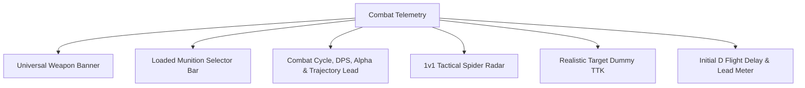
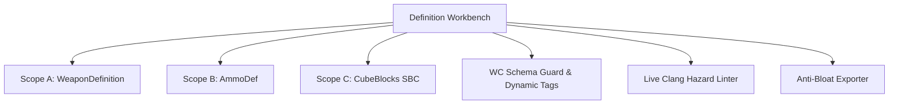

# GVK Weapon Studio — Architecture & Technical Design Document

> **Status**: Active Reference Document  
> **Repository**: `GV-Server-Mods/GVK-Weapons-Pack`  
> **Directory**: `studio/` (this document lives in `studio/`)  
> **Primary Maintainer**: GVK Modding & Systems Engineering Pair Programming  
> **Live Tool**: Open [`studio/index.html`](../studio/index.html) or run `run_studio.bat`

---

## 1. Mission & Architectural Philosophy

The **GVK Weapon Studio** is an offline-capable, zero-dependency browser-based engineering station and combat telemetry suite for the *GV: Deserts of Kharak* Space Engineers server. It bridges the gap between raw WeaponCore C# scripts (`CoreParts/`), Keen XML definitions (`CubeBlocks_*.sbc`, `Blueprints.sbc`), and live gameplay balance.

### Core Architectural Tenets
1. **Zero External Framework Bloat**:
   - Built entirely in native modern HTML5, CSS3 (using CSS custom properties / design tokens), and vanilla ES6+ JavaScript.
   - Zero `npm`, Node.js, or webpack build pipelines required. Runs identically whether launched via a local `file:///` URI or hosted via GitHub Pages / HTTP static server.
2. **Dual Audience UX**:
   - **Combat Telemetry (Workspace 1)**: Player-facing tactical station. Instant readouts, 1v1 radar comparisons, time-to-kill against armor/modules, and drifting rover lead calculations.
   - **Definition Workbench (Workspace 2)**: Deep modder station. Form-based editing of all WeaponCore C# struct tags, SBC component layers, dynamic schema inspector, and anti-bloat C# exporter.
   - **Ammo Logistics (Workspace 3)**: Replaces the spreadsheet's Ammo Maths tab: rebalanced volumes, masses, craft times, prices, RUs and value-weighted blueprints, per-weapon InventorySize suggestions, and SBC export.
3. **Engine-Accurate Ground Truth**:
   - Weapon, ammo, animation, and blueprint datasets are extracted directly from the mod's official source files (`CoreParts/`, `CubeBlocks_Weapons.sbc`, `Blueprints.sbc`, `AmmoMagazines_Ship.sbc`). Character handheld weapons are dropped at load (`stripHandheldData()` in `app.js`), along with the ammos only they fire and the magazines only those ammos load; the studio covers ship weapons only.
   - Calculations rigorously match Space Engineers / WeaponCore engine mechanics (60-tick combat cycles, recursive fragment/AoE damage, burst/reload cycles, and conveyor volume constraints).

---

## 2. Directory & Data Structure

```
GVK_Weapons/
├── studio/
│   ├── index.html                           # Single-page application shell & layout
│   ├── style.css                            # Complete styling, design tokens & light/dark theme engine
│   ├── app.js                               # Core controller, calculation engine & event handlers
│   ├── ammo_maths.js                        # Ammo Logistics: Ammo Maths sheet port (computeAmmoMaths)
│   ├── workbench_ui.js                      # Workbench section navigator, field search, wbReveal()
│   ├── data/
│   │   ├── wc_schema.js                     # WeaponCore v0.75 structure & enum fingerprint
│   │   ├── weapons_data.js                  # 96 mod weapons bundled dataset
│   │   ├── ammos_data.js                    # 63 WeaponCore ammo rounds bundled dataset
│   │   ├── magazines_blueprints_data.js     # 19 official ammo magazines & authentic ingot blueprints
│   │   ├── curation.js                      # Curation: hand-maintained names, icons, magazine categories & multipliers
│   │   ├── animations_data.js               # 18 subpart animation definitions
│   │   ├── components_data.js               # Valid SE component definitions (ores filtered out)
│   │   ├── economy_values.js                # Ingot & component SC values (sheet Components tab)
│   │   ├── weapons_db.json                  # Standalone JSON database mirror
│   │   ├── ammos_db.json                    # Standalone JSON database mirror
│   │   └── components_db.json               # Standalone JSON database mirror
│   └── icons/                               # High-res weapon & ammo DDS-converted PNG icons
├── docs/WEAPON_STUDIO_DESIGN_DOCUMENT.md   # This design document
└── run_studio.bat                           # 1-click launcher for Windows pair programming
```

---

## 3. The Three Workspaces

### Workspace 1: ⚔️ Combat Telemetry & Benchmarks (`#ws-telemetry`)
*Default landing view for all users.*


```mermaid
graph TD
    WS1[Combat Telemetry] --> Banner[Universal Weapon Banner]
    WS1 --> MunitionBar[Loaded Munition Selector Bar]
    WS1 --> HeroStats[Combat Cycle, DPS, Alpha & Trajectory Lead]
    WS1 --> Radar[1v1 Tactical Spider Radar]
    WS1 --> TTK[Realistic Target Dummy TTK]
    WS1 --> DriftMeter[Initial D Flight Delay & Lead Meter]
```

#### Weapon Filter Bar (`#shipbuilderFilterBar`)
- **GRID**: All, Large or Small.
- **CLASS**: All plus the four Classes (`WEAPON_CLASSES` in `app.js`), keyed by the block's `*TYPE*` prefix: **Ballistic** (Gatling, Autocannon, L.Cannon, H.Cannon, Interior, Flak, Railgun, Heavy Railgun, MAC), **Laser** (L.Laser, H.Laser, Plasma, AMS), **Missile** (Rocket, L.Missile, H.Missile, SRBM, Torpedo) and **Special** (Drone, Flare, Sensor, plus the unprefixed Warheads and explosive barrels). NPC weapons strip the `NPC-` prefix, so they share their player twin's Class. Picking a Class with more than one type opens a type sub-row.
- **ROLE**: a dropdown of the Roles (`WEAPON_ROLES`) with counts. A weapon's Role here is the one it gets with the ammo it loads first (`getWeaponRole()`), the same Role its badge shows on selection. Point Defense is a Role, not a Class, so PD turrets of every Class are one pick away.
- Every count follows the other filters, and the weapon dropdown (player and NPC lists) applies all of them.

#### 1. Universal Weapon Banner & Badges
- **Active Weapon Icon & Dropdown**: Large weapon icon with orange border (`#d97706`). Dropdown separated into *Player Standard Armaments* and *⚔️ NPC / Relic / Enemy Armaments*.
- **Dynamic Icon Resolution**: Weapon icons resolve dynamically through `getWeaponIconUrl(weapon)` using block subtype IDs, grid size markers (`(L)` / `(S)` derived from CubeBlock definitions), and Curation (`data/curation.js`) mappings. This ensures large/small variants (e.g. Avenger Turret, Gatling, PD Laser, Light Laser) display their distinct grid textures rather than falling back to broken paths or getting stuck on a default icon.
- **Dynamic GVK Status Badges**:
  - `[ ⚡ X UPs ]`: Utility Points (UPs) dynamically calculated from total Prototech component count (excluding Data Cores). Matches server Spec Core balancing.
  - `[ 👑 Relic Weapon ]` vs `[ ⚙️ Standard Production ]`: Automatically derived from blueprint ingredients (`GVK_RUs` or non-craftable scavenged items).
  - `[ 🔬 [Tech] Data Core ]`: GVK rule gate ensuring any weapon engaging beyond $2\text{km}$ includes a Data Core (subtype `PrototechCircuitry`).
  - `[ 🛡️ Large Grid ]` / `[ 🏎️ Small Grid ]`.
  - `[ ⚔️ NPC Variant ]`: Flags non-player enemy armaments (e.g. Harbinger Cruiser, Gaalsien Raiders).
  - `[ 📡 Point Defense ]`: Flags Turrets whose WeaponCore `TargetingDef.Threats` includes `Projectiles` (Flak turrets, Gatling turrets including the Avenger, AMS lasers, light laser turrets). Point Defense needs a Turret, so Fixed weapons never carry it. Gimbals count as Fixed by GVK definition (`GLOSSARY.md`), even the 25mm Gatling Gimbal, which is built on a turret base and will still fire at missiles inside its ±15° cone in game. These engage smart munitions in flight; `IgnoreDumbProjectiles` makes them smart-only hunters.
  - `[ 🥊 Brawler ]`: the weapon's **Role**, judged from the weapon and its loaded ammo by `getAutomatedWeaponRole()` (`WEAPON_ROLES` in `app.js`): Point Defense, Brawler, Armor Breaker, Area Denial, Beam, Homing Ordnance, Standoff Artillery or Demolition Charge. The 1v1 quick compare shows the same Role for both weapons.

#### 2. Loaded Munition Selector Bar (`.telemetry-ammo-bar`)
- Positioned directly beneath the active weapon banner and **permanently visible across all weapons** (single-ammo and multi-ammo alike).
- Features matching orange border (`#d97706`), ammo magazine icon, and munition selector for dual-load weapons (e.g. High Explosive vs Armor Piercing).
- **Terminal Munition Visibility Filtering (`getSelectableAmmos`)**: Strictly filters out internal fragments and sub-rounds (`hardPointUsable === false`). Weapons with internal sub-projectiles (e.g. Avenger Turret's `NATO 25mm [Energy]` fragment, or Flak/Cannon NPC sub-shrapnel) expose only the true player-selectable terminal rounds, while child projectile damage remains recursively factored into the parent round's telemetry.
- Live badges display the Role, total damage per shot, muzzle speed, max range, and magazine capacity (e.g. `100 rds/mag`, `⚡ 240 rds (virtual mag)`, or `⚡ Continuous`).

#### 3. Recursive Damage Engine & Scalable TimedSpawns Architecture
Calculates true damage potential through multi-stage fragment trees:
$$\text{Total Lifetime Damage} = \text{BaseDamage} + \text{AreaOfDamage} + \sum_{\text{frags}} (\text{Count} \times \text{Damage}_{\text{child}})$$
- **Area of Damage (AoE)**: `ByBlockHit` (per block hit, impact block excluded) and `EndOfLife` (detonation) count only when their `Enable` is true. `Pooled` spends the whole pool; every other falloff is replayed on an ideal solid hull of the target grid size with WC's `RadiantAoe` block rings (`Radius`/`Depth` in metres, Diamond = Manhattan, Round = rounded Euclidean) and the `DamageGrid` falloff formulas; `Legacy` (unset) deals nothing, `MaxAbsorb` caps the total. EWAR rounds (`Ewar.Enable`) deal no base or area damage.
- **Fragments & Patterns**: fragment and pattern rounds resolve by `AmmoRound` within the weapon's full `Ammos` list (as `AmmoConstants` does). A Weapon-mode `Pattern` spawns its expected member count per trajectile (`PatternSteps`, or `Random` via WC's `XorShift Range(min, max)`); Fragment-mode patterns pick the fragment from the pattern list.
- **Scalable TimedSpawns Delivery Duration ($\Delta T_{\text{delivery}}$)**:
  Evaluates `TimedSpawnDef` (`maxSpawns`, `groupSize`, `interval`, `groupDelay`):
  $$\text{numBursts} = \left\lceil \frac{\text{totalSpawns}}{\text{groupSize}} \right\rceil, \quad \Delta T_{\text{delivery}} = \frac{(\text{numBursts} - 1) \times \text{groupDelay} + \text{groupSize} \times \text{interval}}{60\text{ ticks/sec}}$$
- **Magazine Damage & Alpha**:
  **Magazine Damage** is what one full magazine delivers; the hero subline adds the loaded total for weapons with `MagsToLoad > 1`. **Alpha** is one trigger pull (one fire event, or one full `ShotsInBurst` burst, every barrel firing, capped at the loaded rounds):
  $$\text{TotalRounds} = \text{MagSize} \times \text{MagsToLoad}$$
  $$\text{MagazineDamage} = \text{RoundDamage} \times \text{MagSize} \times \text{Trajectiles}, \quad \text{LoadedDamage} = \text{RoundDamage} \times \text{TotalRounds} \times \text{Trajectiles}$$
  $$\text{Alpha} = \text{RoundDamage} \times \min(\max(1, \text{ShotsInBurst}) \times \text{Barrels}, \text{TotalRounds}) \times \text{Trajectiles}$$
  - **Physical Multi-Magazine Weapons**: Weapons loading multiple magazines (e.g., Cyclone Cannon with $2 \text{ mags} \times 1 \text{ rd} = 2 \text{ rds}$; Hurricane with $2 \text{ mags} \times 1 \text{ rd}$, so Magazine Damage $80{,}000\text{ hp}$ and $160{,}000\text{ hp}$ loaded; Cannon Gun with $4 \text{ mags}$; Gatling Avenger with $14 \text{ mags} \times 100 \text{ rds} = 1{,}400 \text{ rds}$) show one magazine as the headline and the loaded payload, delivered before the reload, in the subline.
  - **Virtual Magazines for Energy Weapons**:
    - *Recharge/Capacity Beams*: When `AmmoMagazine == "Energy"` and `EnergyMagazineSize > 0` (e.g., Heavy Laser Turret = 240 ticks / $36{,}000\text{ hp}$; Spartan Turret = 480 rds / $72{,}000\text{ hp}$; Harbinger Railgun = 1 round / $1{,}000{,}000\text{ hp}$), `getShotsPerMag` resolves the virtual magazine capacity. Firing the virtual magazine triggers a recharge/reload cycle (`ReloadTime`). Badge indicates `⚡ <N> rds (virtual mag)`.
    - *Derived Energy Magazines*: When `EnergyMagazineSize <= 0` and `ReloadTime > 0`, WC sizes the magazine as $\lceil \text{EnergyCost} \times \text{BaseDamage} \times \frac{\text{RoF}}{3600} \times \text{Barrels} \times \text{Trajectiles} \times \text{ReloadTime} \rceil$ (`AmmoConstants.Energy()`), evaluated in float32 like the C# source (so $2{,}000.0002 \rightarrow 2{,}001$). `WcMath.energy` mirrors this and the charge passes `SessionCharging` needs.
    - *Continuous/Heat-Based Beams*: When `EnergyMagazineSize <= 0` and `ReloadTime == 0` (e.g., `MA_PDT` / `Lasers_AMS` Point Defense Laser, radar designators), the weapon operates continuously with no magazine reload downtime. Resolves 1 round per event (`BarrelsPerShot || 1`), displaying `⚡ Continuous` on the badge and preventing arbitrary 100-round virtual magazine fallbacks.
- **Fire Cycle (`computeFireCycle` → `studio/wc_math.js` `WcMath.simulateFire`)**: a tick-by-tick replica of WC, in `Session.Simulate()` order: heat FutureEvents (`UpdateWeaponHeat` every 20 ticks), the AiLoop reload check and shoot gate, the charger, then `Weapon.Shoot()`. Rates are the steady state measured between reload (or overheat-recovery) boundaries.
  - Each barrel spends 1 magazine unit per fire event (`TrajectilesPerBarrel` is free); events are `(uint)(3600f / RoF)` ticks apart (RoF above 3600 fires every tick).
  - The reload starts the tick after the last shot and the next shot lands on `ReloadEndTick`, so a plain magazine cycles in $(\text{Events} - 1) \times \text{TicksPerShot} + \text{ReloadTime} + 1$ ticks; energy reloads take the charge passes instead, hybrids wait for both. `ReloadTime = 0` reloads in the same pass.
  - `DelayUntilFire` replays whenever the shoot gate closes (every non-instant reload, overheat) and after each true burst.
  - `ShotsInBurst`: true burst mode (energy, or capacity $\ge$ `ShotsInBurst`) resets per magazine; shot-reload mode (capacity < `ShotsInBurst`) keeps counting across reloads, and a burst ending on an empty magazine stretches the reload to `DelayAfterBurst`. `FireFull` follows `FinishMode`.
  - Heat: `HeatPerShot × HeatModifier` per barrel, `HeatSinkRate / 3` removed every 20 ticks, overheat at `MaxHeat` until heat falls to `MaxHeat × Cooldown` (clamped 0–0.95), `DegradeRof` scales RoF by the heat lerp, `AllowOverheatShooting` clamps instead of stalling. A heat-limited weapon sustains about $\text{HeatSinkRate} / \text{HeatPerShot}$ shots/s.
  - Sustained DPS $= \text{Trajectiles/s} \times \text{DamagePerRound}$.
- **Effective DPS**: every damage part takes its own ammo's per-block `damageScale` (`Grids`, `Armor`/`Heavy`/`Light`/`NonArmor`, `NoGridOrArmorScaling`, the 0.25× large-vs-small debuff when both grid scales are unset) against large and small hulls; the best target sets the multiplier.
- **Power**: every weapon draws `IdlePower` (min 0.001 MW); energy and hybrid rounds add `ShotEnergyCost × RoF/3600 × Barrels × Trajectiles` MW while charging (`SinkPower` / `UpdateDesiredPower`).
- **Cutoff Scaling**: `ArmorForCutoff` / `GridSizeForCutoff` multiply `BaseDamageCutoff` per target class before the normal armor multiplier ($\text{PerHit} = \min(\text{Base}, \text{Cutoff} \times \text{CutoffScale}) \times \text{ArmorMult}$). WC enables it only when a field is $> 0$; any omitted `ArmorForCutoff` field is $0$ (zero cap), so the exporter always writes all four. The pool keeps penetrating while more than 0.5 remains: $\lceil (\text{Base} - 0.5) / \text{Cutoff} \rceil$ blocks.
- **Tests**: `node scratch/run_studio_tests.js` runs every suite. `scratch/test_wc_parity.js` holds the WC tick traces, float32 energy cases, a literal `RadiantAoe` transcription, damage scaling, pipeline field fidelity and a lint that fails on any weapon- or ammo-name rule.
- **WeaponCore Schema Guard**: `data/wc_schema.js` stores the `[ProtoMember]` field and enum signature of `CoreParts/script/Structure.cs`. On load the Studio fetches upstream `CoreDefinitions.cs` (Ash-LikeSnow/WeaponCore@master) and diffs it (`extractWcSchema` / `diffWcSchema`); the header badge shows Synced, `⚠️ WC Update` with the change list, or Unverified when offline. `node scratch/export_snapshots.js` regenerates the signature after Structure.cs is synced.
- **Instantaneous Cluster vs Loitering Deployable Scaling**:
  - **If $\Delta T_{\text{delivery}} \le 1.0\text{s}$** (Flak, Proximity Warhead, Cluster Bomb):
    All fragments arrive in the initial strike:
    $$\text{RoundDamage} = \text{BaseDamage} + \text{AreaOfDamage} + (\text{totalSpawns} \times \text{ChildDamage})$$
    $$\text{Sustained DPS} = \text{RPS} \times \text{TotalLifetimeDamage}$$
  - **If $\Delta T_{\text{delivery}} > 1.0\text{s}$** (Drones, Loitering Minefields, Area Denial):
    Initial burst contributes to opening salvo; sustained payload delivers over time:
    $$\text{RoundDamage} = \text{BaseDamage} + \text{AreaOfDamage} + (\min(\text{groupSize}, \text{totalSpawns}) \times \text{ChildDamage})$$
    $$\text{LoiterDPS} = \frac{\text{TotalLifetimeDamage}}{\Delta T_{\text{delivery}}}$$
    $$\text{MaxConcurrent} = \min\left(\text{MagsToLoad}, \max\left(1.0, \frac{\Delta T_{\text{delivery}}}{\text{CycleSec}}\right)\right)$$
    $$\text{Sustained DPS} = \text{LoiterDPS} \times \text{MaxConcurrent}$$
  - Guarantees the **MAC Gun** ($2,000,001\text{ Alpha}$) remains the server's undisputed top Alpha weapon, while loitering summons (e.g. Falcon Drone at $45,001\text{ Alpha}$, $26,447\text{ DPS}$) scale realistically.

#### 4. Target Damage & Multiplier Matrix (`.target-matrix-card`)
Renders authentic weapon-to-target lethality across 4 key combat target profiles:
- **Heavy Armor**: Multiplier ($\text{e.g. } 3.0\times\text{ on AP, } 1.0\times\text{ on HE}$), effective shot damage ($\text{e.g. } 18,000\text{ hp vs } 12,000\text{ hp}$), and Magazine Damage. Highlights armor-shredding penetration.
- **Light Armor**: Multiplier ($\text{e.g. } 0.5\times\text{ on AP, } 1.0\times\text{ on HE}$), and effective damage. AP's 0.5× here is simply a low Armor Multiplier against Light Armor; **Overpenetration** means the per-block damage cap (`BaseDamageCutoff`, below).
- **Systems**: Multiplier ($\text{e.g. } 1.0\times\text{ on 155 AP; unset } (-1) \text{ resolves to } 1.0\times$) and effective damage against internal systems (batteries, refineries, thrusters, gyros).
- **Blast & Splash**: Detonation radius ($\text{e.g. } 4.0\text{m}$), blast damage ($6,000\text{ hp}$), and penetration depth ($4.0\text{m}$ Pooled).
- Row subtexts show Magazine Damage (plus the Overpen cap when present) only — the per-row multiplier badge already carries the shred/resist story.
- **Blast classification**: rows are labeled High Explosive only when the burst can actually damage blocks. Token-damage wide bursts (Flak PROX: 101m @ 1 hp with grid scaling zeroed) display as an Anti-Missile Screen with 0 hp, and WeaponCore EWAR rounds (flare AntiSmartv2 field, torpedo Offense shrapnel) show the EWAR type/radius with 0 hp — per WC source, `Ewar.Enable` disables the base and AoE payload entirely. The TTK dummy reports `No Block Damage` for zero-payload munitions.
- **Target Dummy Time-to-Kill (TTK)**: Applies true target multipliers ($\text{Damage}_{\text{target}} = \text{Base} \times \text{Multiplier} + \text{AoE} + \text{Frag}$) when simulating shots and time to destroy Light Armor, Heavy Armor, Battery, and Refinery cubes. Demonstrates why 155 AP destroys a Heavy Armor Cube in 1 salvo ($18\text{k dmg} > 16.5\text{k hp}$) while 155 HE requires 2 salvos.

> **Shieldless Migration Note**: The GVK server runs without shield mods, so all shield surfaces were removed from the Studio — matrix column, Workbench controls, WC C# exporter output, and minimal-def seeds. The **Systems** profile took the Shields slot in the matrix. WeaponCore's upstream shield fields remain in the reference source and bundled data, but are never displayed or emitted by this tool.

**Effective DPS (Best-Fit Target)** — raw base DPS is pre-multiplier. The hero card's big number shows the round's peak ideal: the full sustained payload scaled by whichever armor multiplier is highest:
$$M_{\text{best}} = \max(\text{Heavy}, \text{Light}, \text{Systems}), \quad \text{Effective DPS} = \text{Sustained DPS} \times M_{\text{best}}$$
Unset multipliers ($-1$) resolve to $1.0\times$. The blue disclaimer beneath states where the multiplier bites — e.g. "Effective against Heavy Armor (×3.0) · Base: X DPS" — preserving the raw figure; two-way ties join labels and all-equal rounds read "All Blocks". The peak interpretation intentionally ignores the Overpen cap (the full payload does land on the grid, just spread across blocks) — per-block reality stays in the matrix rows, TTK and 🪡 chip. The Magazine Damage hero follows the same best-fit theme (instant payload × $M_{\text{best}}$; the blue disclaimer carries the base Magazine Damage, the Alpha of one trigger pull and, for multi-magazine weapons, the loaded total, e.g. "Alpha: 100 hp · × 4 loaded = 12,000 hp"). Target matrix rows show Magazine Damage per block type the same way. The footer's Alpha is that same one-trigger-pull figure. Per the WeaponCore wiki, DamageScales armor modifiers multiply the projectile's BaseDamage (AreaEffect/Detonation carry their own damage types and are not documented as armor-scaled), which is the convention the matrix rows follow. The 1v1 radar and compare table use Effective DPS and effective Magazine Damage for both weapons.

**Sustained RPM Hero Card** — displays true sustained fire rate in **Rounds Per Minute (RPM)**, reflecting cyclic fire time plus reload downtime:
$$\text{Sustained RPM} = \text{Sustained RPS} \times 60 = \left(\frac{\text{Total Rounds}}{\text{Burst Time} + \text{Reload Time}}\right) \times 60$$
The hero card subline provides the weapon's burst fire rate (`Burst: X RPM · Y sps sustained`), pairing seamlessly with the combat cycle bar below.

**Target Damage & Multiplier Matrix** — clearly labels large readout numbers as damage per shot (`hp / shot`), with the card border dynamically highlighted in cyan for whichever block type takes peak damage per shot (Heavy Armor, Light Armor, or Systems).

**Overpen (`BaseDamageCutoff`)** — per WeaponCore source, penetrating rounds apply at most Cutoff damage per block hit and carry the remainder onward:
$$D_{\text{block}} = \min(\text{BaseDamage}, \text{Cutoff}) \times M_{\text{target}}, \quad N_{\text{blocks}} = \left\lfloor \frac{\text{BaseDamage}}{\text{Cutoff}} \right\rfloor$$
- The cap **redistributes** damage, never destroys it: raw DPS and total alpha (e.g. the MAC's $2{,}000{,}001$) are unchanged.
- Matrix volleys and the TTK simulator use $D_{\text{block}}$ (a single cube cannot absorb the full base damage of a capped round); the matrix header shows a `🪡 Overpen: N blocks @ X hp` chip whenever `BaseDamageCutoff > 0` (it replaces the retired "Loaded" munition badge, which duplicated the munition bar).

#### 5. Sustained Fire Rate & Combat Cycle
Positioned directly beneath the 7 hero cards to explain sustained fire rate and duty cycle without repeating redundant cycle formulas in the hero card:
- **Inlined Loading Rate of Fire**: Evaluates exact `LoadingDef.RateOfFire` values parsed per weapon (e.g. Khopesh Turret at 360 RPM, Thrasher Autocannon at 480 RPM, Hurricane Heavy Cannon at 120 RPM), preventing inverted DPS readings across similar weapon families.
- **Duty Cycle Percentage**: Real-time ratio of firing uptime vs reload downtime.
- **Consumption Rate**:
  - **Physical Munitions**: Computes exact magazine burn rate ($\text{mags/min}$).
  - **Energy Weapons**: For energy-draining systems, derives Uranium consumption ($\text{kg/min}$ based on $1\text{ MWh} = 1\text{ kg Uranium}$).

#### 6. Hexagonal Tactical Radar (`#radarCanvas`)
- Plots 7 normalized tactical axes dynamically scaled across the dataset:
  1. **DPS** (Sustained Damage Per Second)
  2. **Mag Dmg** (Magazine Damage: the loaded magazines' payload)
  3. **Targeting Range**: engagement range from `getEngagementRange()` in `app.js`, the single resolver every range readout uses (pillar card, footer, radar, role tags). Turrets and guided munitions (any `Guidance` other than `None`, e.g. Smart missiles, torpedoes and drones) are gated by the block's `MaxTargetDistance`. Manually aimed fixed guns with unguided rounds use the round's `MaxTrajectory`. Either way, the range never exceeds the round's reach.
  4. **Muzzle Velocity** (Projectile flight speed)
  5. **Tracking Rate** (Azimuth & Elevation traverse agility in deg/s)
  6. **Block Integrity** (Cube block durability)
  7. **Power Draw** (Operational power draw in MW — idle + sustained firing energy)
- **1v1 Benchmark Comparison**:
  - Active weapon in **Amber/Orange** (`#f59e0b`).
  - Benchmark weapon in **Cyan/Blue** (`#38bdf8`).
  - Outliers (such as the 200mm MAC and SRBM) scale naturally without clipping or special case filtering.
  - Side-by-side comparison card displaying active weapon name & description above benchmark weapon name & description.

#### 7. Tactical Tools
- **Initial D Flight Delay & Drift Lead**: Projects target intercept flight time at $500\text{m}$, $1000\text{m}$, and $\text{Max Range}$, and calculates dune drift lead at $100\text{ km/h}$ ($27.8\text{ m/s}$).
- **Target Dummy Time-to-Kill (TTK)**: Real-time simulation against Light Armor ($3\text{k HP}$), Heavy Armor ($16.5\text{k HP}$), Battery ($11.4\text{k HP}$), and Refinery ($37.3\text{k HP}$) with active damage scale modifiers applied.
- **🔗 Share Permalinks**: Encodes configuration state (`?gun=...&ammo=...&vs=...`) for instant Discord sharing.

---

### Workspace 2: 🔧 Definition Workbench (`#ws-workbench`)
*Deep modder configuration mirroring WeaponCore C# structures and Keen SBCs.*


```mermaid
graph TD
    WS2[Definition Workbench] --> ScopeA[Scope A: WeaponDefinition]
    WS2 --> ScopeB[Scope B: AmmoDef]
    WS2 --> ScopeC[Scope C: CubeBlocks SBC]
    WS2 --> SchemaGuard[WC Schema Guard & Dynamic Tags]
    WS2 --> Linter[Live Clang Hazard Linter]
    WS2 --> Exporter[Anti-Bloat Exporter]
```

#### Layout & navigation
Top to bottom: the **editing context** strip (weapon picker, **↺ Reset to Shipped** to discard the Draft, grid/mount/UP/tech badges; shared by all three scopes since the ammo and block both belong to that weapon), the **scope switcher** (Weapon · Ammo · Block, with New Weapon/Ammo and mod-folder actions), the **lint banner** (one line for a single issue, a list for several), then a two-column body:
- **Section navigator** (`workbench_ui.js`, sticky left column; chips under 1100px): one entry per accordion in the active scope with scroll-spy, Expand all / Collapse all, and **Find a field** (`/` to focus, Enter jumps to the first match, Esc clears). Search matches label, WC field name with or without spaces, control id and help text; non-matching fields, notes and empty groups hide, matching sections open and close again when the search clears. A section whose title matches but none of its fields do is shown whole.
- **Section headers** read `[n] Plain-English name  WcDefName  [status tag]`, so the C# struct name stays visible without being the headline.
- **Checkbox options** are cards in a responsive grid: label, help text underneath, amber when on, and a `default` pill when the mod file doesn't set the flag (WeaponCore's default applies).
- Open/closed state per section is remembered in `localStorage` (`GVK_WB_SECTIONS_OPEN`).
- `wbReveal(el)` (global) switches to the field's scope, clears a search that hides it, opens its section and scrolls to it; Ammo Logistics' "Edit damage" and "Set X kL" use it.

#### 1. Scope A: `WeaponDefinition` Editor
Form controls categorized strictly matching the C# struct layout:
- `ModelAssignmentsDef` (Subtypes, dummy muzzles, elevation/azimuth subparts)
- `HardwareDef` (Elevation/Azimuth traverse rates, limits, idle power, offset)
- `LoadingDef` (RoF, barrels, reload ticks, burst delays, magazines to load)
- `HardPointDef` (Accuracy deviation, aiming tolerance, prediction, water fire)
- `TargetingDef` (Min/Max ranges, top targets/blocks, threat flags, subsystem targeting)
- `AiDef` & `UiDef` (Slave control, terminal sliders, guide toggles)
- `HardPointAudioDef` (Firing, reload, rotation, travel SFX)
- `OtherDef` (Part caps, energy priority, LOS checks)
- Multi-ammo assignments and 18 subpart animation controllers.

#### 2. Scope B: `AmmoDef` Editor
Full canonical WeaponCore round engineering:
- Header & Core (Base damage, cutoff, mass, health, kick force)
- `TrajectoryDef` & `SmartsDef` (Speed, acceleration, lifetime, pro-nav guidance, scan rates)
- `DamageScaleDef` (Heavy Armor, Light Armor and Systems multipliers, grid scaling, falloff)
- `AreaOfDamageDef` (impact `ByBlockHit` and End-of-Life AoE `EndOfLife` radii, damage and AoE Depth)
- `FragmentDef` (Child ammo round triggers, spawn counts, radial dispersion)
- `PatternDef`, `EwarDef`, `GraphicDef` (Tracers & ribbon trails), and `AmmoAudioDef`.

#### 3. Scope C: `CubeBlocks SBC` Editor & Standardizer
- **Enforced Vanilla AI Targeting Suppression**: Automatically enforces `<AiEnabled>false</AiEnabled>` to eliminate vanilla Keen turret lag loops.
- **Component Layers Recipe Editor**:
  - Filtered strictly to valid construction components (all raw ores and ingots suppressed except `GVK_CUs`).
  - Allows adjusting quantities, reordering layers, adding components, and deleting layers.
  - **Dynamic Build Time Calculation**:
    $$\text{BuildTime} = \max\left(5, \operatorname{round}\left(\frac{\text{WeaponIntegrity}}{\text{BuildTime\_Dividend}}\right)\right) \quad (\text{Default Dividend} = 750)$$
  - **Auto-Derived Prototech Tech Requirements**:
    Scans layers for Prototech items (`Machinery`, `Frame`, `Circuitry`, `Capacitor`, `Propulsion`), derives total UPs, and automatically verifies the $>2\text{km}$ Data Core rule (`Circuitry` here is the Prototech subtype suffix).
- **Embedded Real-Time SBC Exporter**:
  - Displays formatted `<Definition xsi:type="MyObjectBuilder_WeaponBlockDefinition">` XML with syntax highlighting.
  - `📋 Copy SBC XML` and `💾 Download .sbc` buttons for immediate in-game testing.

#### 4. WeaponCore Schema Guard & All-Fields Editor
- Tracks `CoreParts/script/Structure.cs` fingerprint against upstream WeaponCore. `export_snapshots.js` also writes the qualified type tree (every struct, field and enum) plus field comments harvested from `CoreParts/*.cs` into `wc_schema.js`.
- **Def trees drive the editors** (`wc_editor.js`): the pipeline keeps each AmmoDef/WeaponDefinition as a lossless tree (`wc_defs_data.js` snapshot, or live-parsed). Enum literals and shared helper refs stay bare identifiers; `Random()`/`Vector()`/`Color()` calls stay calls.
- **All WeaponCore Fields accordion** (weapon §11, ammo §12): schema-driven editor for every Structure.cs field, with typed inputs, enum dropdowns, filter search, set-only view, per-field revert/unset, and add/remove for struct arrays (MountPoints, Approaches…). A newly synced WC field appears here automatically.
- **Curated panels write the same tree** through the `WC_BINDINGS` table (element id → field path), so both views and the DPS model always agree.
- **Shared helpers**: untouched helper refs (e.g. `Common_Weapons_Hardpoint_Ui_FullDisable`) export as the ref. Editing a field inside one detaches a local copy for that definition only; revert re-links it.
- **Lossless exporter**: C# export serializes the tree — every field the source file sets is kept, edits are applied, and ✕ (unset) removes a field. The smoke test round-trips all 128 GVK defs byte-identically.

#### 5. Design Notes — Field Tooltips & Legacy Field Visibility Policy

- **Where tooltips come from**: Workbench field help is adapted from the canonical comments in `data/Scripts/CoreParts/Weapon75Part.cs` / `Weapon75ammo.cs`, stored in the `WORKBENCH_FIELD_HELP` dictionary in `app.js` (keyed by control id, applied at init via `applyWorkbenchFieldHelp()`). New controls need a matching dictionary entry and a `WC_BINDINGS` row in `wc_editor.js`; the All-Fields editor uses the harvested CoreParts comments.
- **Ground truth for "is this field live"**: GVK's own `CoreParts/*.cs` usage counts — not `data/wc_schema.json` (its structs are incomplete). A field counts as in use only if written non-default somewhere in the mod.
- **Canonical enum dropdowns**: Guidance, AOE Falloff, AOE Shape and EWAR Type dropdowns list every value of the matching Structure.cs enum (including `Legacy` falloff, `Remote`/`DroneAdvanced` guidance and the `Dot`/`Push`/`Pull`/`Tractor`/`AntiSmartv2` EWAR types) and nothing else, so a source value always displays and the exporter can never emit a non-compiling tag.
- **Current-but-unused WC fields**: Fields WeaponCore supports but GVK never enables are kept out of the default UI — either fully absent (rarely-needed exotics, reachable via the **All WeaponCore Fields** accordion) or parked in collapsed accordions (`CheckForAnyWeapon` in OtherDef, `DamageModifier` in AiDef & UiDef). `Radial` (FragmentDef) stays visible but intentionally `0` for all GVK fragment weapons; the exporter writes it only if the source sets it or it is edited.
- **Deprecated fields**: `EnergyPriority` is marked "Deprecated." in the canonical sample and is fully removed from the UI and exporter.

---

### Workspace 3: 📦 Ammo Logistics & Blueprints (`#ws-logistics`)
*Replaces the "Ammo Maths" tab of `GVK Ship Weapon Scales Kharak.xlsx` (the pricing and recipe maths are the sheet's; size, mass and craft time use baseline curves × per-magazine multipliers). The logic lives in `ammo_maths.js`, where `computeAmmoMaths(mag, levers, env)` is a pure function shared by the tab, the overview, the Workbench check and the smoke test.*

#### Layout
- **Header**: magazine dropdown, **◀ ▶** stepper (walks the All Magazines order and filter), Reset All Levers, ⚙ Ammo Settings (opens the Balance Matrix at the ammo section), then status chips: levers edited, recipe drift, SBC fields that change (or ✓ Matches SBC), weapons short on inventory, player Mags Carried under 2. Chips jump to the section they summarise. The weapon filter bar (GRID / CLASS / ROLE) is hidden on this tab.
- **Physical** panel: Damage Basis card, Volume / Mass / Craft Time levers, damage per mag / L / kg (vs the fleet median), Carrying Capacity table.
- **Economy & Recipe** panel: Server Price headline (Baseline price × Price Tier, Damage / SC vs median, Recipe Budget, RU cost when non-zero), Server Price lever, Hybrid round, Blueprint Recipe table.
- **What Will Change in the SBC**: every SBC field export compares, unchanged rows muted, recipe value total; the per-magazine Blueprints / AmmoMagazines XML is a collapsible section.
- **Weapons Using This Mag**, then **All Magazines** with the Ammo Comparison chart.
- **Footer HUD**: Server Price, Damage / SC, Damage / Mag, One Mag Fires For, drift chip, "N mags changed" (filters All Magazines to Changed) and ⚡ Export Changed.

#### 1. Baselines × multipliers (one multiplier per output)
Every output starts from a baseline curve that scales with the magazine's damage relative to the Baseline Magazine (the Gatling, 3,000 dmg). Each magazine then has one multiplier per output, and a multiplier changes only its own output:

| Output | Baseline (Balance Matrix → Ammo Baselines) | Per-magazine multiplier |
|---|---|---|
| Volume | `Reference Volume (30 L) × (dmg ÷ Baseline Magazine dmg)^Size Exponent (0.6)` | **Size ×** |
| Mass | `Reference Mass (30 kg) × (dmg ÷ Baseline Magazine dmg)^Mass Exponent (1)` | **Mass ×** (<1 = more damage per kg) |
| Craft time | `Reference Craft Time (13 s) × (dmg ÷ Baseline Magazine dmg)^Craft Exponent (0.5)` | **Craft ×** |
| Price | `Baseline Magazine Price (1,500 SC) × (dmg ÷ Baseline Magazine dmg)` | **Price ×** (Price Tier) |

- The Size/Mass/Craft multipliers in the Curation (`data/curation.js`) were seeded from the Shipped SBC, so the Shipped levers reproduce every tracked magazine's current volume, mass and craft time exactly. Because they're stored, a damage change moves all four outputs along the curves while each magazine keeps its character. A magazine without stored multipliers reads them back from its SBC values.
- This replaces the sheet's Damage Density, Ammo Density, the Volume Buff and the craft-time override. The size reduction from commit `351d2af` and Plasma's hand-set 72 s are now just those magazines' Size × and Craft × values.
- **Two-way levers**: Volume, Mass, Craft Time and Server Price each show `× multiplier → target`. Typing a target solves the multiplier (4 decimals) from the curve value; leaving the field shows the value the rounding lands on. The Server Price **Price Tier** dropdown (Standard 1.0, AP 1.1, Railgun 1.2, Missiles 1.25, MIRV 1.5, Custom) sets the multiplier.
- **Damage Basis** card: Reference Ammo (which AmmoDef supplies the damage per round), `dmg/hit × capacity = dmg/mag` (hover for base / area / fragment parts), the ratio to the Baseline Magazine and the three curve values at that ratio. **✎ Edit damage in Workbench** opens a player weapon firing that AmmoDef with BaseDamage in view; the Baseline Magazine and curve settings link into the Balance Matrix.
- Other levers:
  - **Hybrid Round**: defaults to the WC `HybridRound` value.
  - **RUs**: one control on the recipe's RU line: **None**, **Fixed** (a typed quantity, seeded with the auto value) or **Auto from price** (relic ammo, RU Share of the budget).
- **Blueprint Recipe** table: Ingot | Weight | Value % (share of the recipe value) | New | SBC | Δ. Below it: total ingot kg vs magazine mass, ingots the SBC has that the composition dropped, a warning when the new recipe is worth over 2× or under 0.5× the live one, and the salvage estimate.
- Lever edits are saved per magazine in localStorage (`GVK_AMMO_LEVERS`). Only values that differ from the Shipped values are stored, and keys from older models are dropped on load.
  - An edited lever gets an amber rail and its own ↺ button.
  - Edited mags get a ● in the dropdown and in the overview.
  - **Reset All Levers** clears the magazine's saved edits, returning it to its Shipped values.

#### 2. Formula chain
| Output | Formula |
|---|---|
| Mag damage | damage per hit × capacity |
| Volume | baseline × Size ×, rounded to 10 L from 100 L up (whole litres below) |
| Mass | baseline × Mass ×, same rounding (independent of Size ×) |
| Craft time | `ROUND(baseline × Craft ×)` |
| Baseline price | Baseline Magazine Price ÷ Baseline Magazine damage × magDmg × (hybrid ? Hybrid Discount : 1) |
| Server Price | 2 significant figures of Baseline price × Price × (what the player pays) |
| Recipe Budget | Baseline price × Price × × Assembler Efficiency, rounded at the **price's** 2nd significant figure. **Recipe budget only**: the server's assembler efficiency multiplier reduces ingot use, so the recipe is inflated to match. Players pay the Server Price. |
| SC / Dmg | Adj ÷ magDmg ÷ Assembler Efficiency. The tab shows its inverse, **Damage / SC** (higher = cheaper damage). |
| RUs | `ROUND(Adj × RU Share ÷ value(GVK_CUs), 1)` for relic ammo |
| Recipe | `ROUND(baseVal_i ÷ ΣbaseVal × (Adj − RU cost) ÷ value_i, 1)`, where `baseVal_i = ROUND(value_i × weight_i)` |
| Cargo | mags = ⌊C ÷ Vol⌋; damage = C ÷ Vol × magDmg; weight = C ÷ Vol × Mass |

Every output shows its formula, with the live numbers plugged in, as a hover tooltip.

#### 3. Economy settings & values (Server Balance Matrix)
- **Ammo Economy & Logistics**: Baseline Magazine Price (1500), Baseline Magazine (the Gatling), Hybrid Discount (0.75), RU Share (0.75), Reload Buffer (2.2), Small and Large Cargo (3,375 L and 421,875 L) and Player Inventory (4,500 L = 1.5 m³ from the GVK Character Changes mod × the server's `InventorySizeMultiplier` of 3), plus the six **Ammo Baselines** (Reference Volume 30 L / Size Exponent 0.6, Reference Mass 30 kg / Mass Exponent 1, Reference Craft Time 13 s / Craft Exponent 0.5). All of these are stored in `balanceMatrix` (`baselineMagPrice` and `baselineMag` were `ammoAnchorMsrp` and `ammoAnchorMag`; `migrateBalanceMatrix()` in `app.js` renames them when older saved or exported settings load).
- **Ingot & Component Values**: this is the sheet's Components → Value column. The defaults are in `data/economy_values.js`, and edits are saved to `GVK_ECONOMY_VALUES`.
- **Export / Import Ammo Settings**: all levers, value edits, economy settings and Auto-InventorySize flags as a single JSON file (`kind: gvk-ammo-settings`).

#### 4. Weapons Using This Mag (per WeaponDefinition)
- Each WeaponDefinition gets its own row, because MagsToLoad and InventorySize are set per definition. NPC weapons and NPC mount points are excluded.
- **Suggested InventorySize** = `ROUNDUP(Vol × Reload Buffer × MagsToLoad, −1) ÷ 1000` kL. It is compared with the live WC `HardPoint.HardWare.InventorySize`. The SBC `InventoryMaxVolume` is ignored because WeaponCore overrides it.
- Live inventory is flagged **⚠ short** (fewer than 2.2 × MagsToLoad reloads), **+N% over** (above the suggestion, so applying it would shrink it) or ✓.
- Default columns: MagsToLoad, Rounds/s (from the shared `computeFireCycle`), DPS, Suggested Inv., Live Inv. (mags held), Live Inv. Lasts (continuous fire).
- **Show throughput** adds L/s, Min Mags, Mags/min, SC/min (hover for ingot kg/min) and one-gun small / large cargo endurance.
- Click a row to pin that weapon for the Carrying Capacity fire times and the HUD. Row actions:
  - **Set X kL** opens the weapon in the Workbench with the suggested InventorySize set (disabled when it already matches).
  - **📋 C#** copies the `InventorySize = x` line.
- **Carrying Capacity** (Physical panel): player inventory, small and large cargo in one table: capacity, mags, damage stored, weight and how long one gun of the pinned weapon fires from it. Durations read `1m 18s` / `2h 41m`.

#### 5. All Magazines, comparison chart, export
- **Overview table**: the sheet's side-by-side column view, with SBC → new values, Damage / SC (amber outside ±15% of the median), Mags Carried (player / small cargo; red below 2, the target from commit `351d2af`), recipe drift (Ammo Maths recipe value vs the SBC recipe value; highlighted red above ±5%), a count of weapons with short inventory, and the number of SBC fields that would change. Headers sort; filter chips (All / Changed / Drift / Short Inv / Mags Carried < 2) scope the table and the ◀ ▶ stepper. Click a row to select that magazine.
- **Ammo Comparison chart**: ranked bars for damage / SC, damage / L or damage / kg, with a median line. The selected magazine is shown in amber; click a bar to open it.
- **Export All Changed Mags**: shows an old → new diff for each field, then two outputs, a **Blueprints.sbc** block and an **AmmoMagazines.sbc** block. Both patch the raw source definitions (captured by `source_pipeline.js` as `bpXml` / `sbcXml`), so any tags that weren't edited are kept.
- **Export All SBC**: one click downloads `GVK_AmmoBlueprints.sbc` and `GVK_AmmoMagazines.sbc`. They are complete `<Definitions>` files covering every tracked magazine, changed or not, with the Ammo Maths values applied through the same patching. They replace the matching definitions in the existing SBCs, so remove those to avoid duplicates.

#### 6. Workbench link
- Under **Inventory Size** there is a hint: `Suggested: X kL (2.2 × N mags × Vol L)`.
  - **Use** writes the suggestion into the WC tree, so it appears in the C# export.
  - **Auto** keeps the field synced, saved per definition in `GVK_AUTO_INVSIZE`.
- A value below the buffer turns the input red and adds a lint warning.
- If the active ammo's recipe has drifted more than ±5% from its Ammo Maths value, a **Recipe drift** chip appears in the Workbench HUD, a lint warning is added, and the chip opens that magazine in Logistics.

---

## 4. Design Tokens & Theme Engine

### Header
`<header id="appHeader">` is a CSS grid with three layouts:
- **≥1500px**: brand · workspace tabs · actions in one row. Status chips cap at 190px (280px from 1800px, where "& Blueprints" also shows); the repo name appears from 2000px.
- **<1500px**: brand + actions, tabs on a full-width second row with equal-width tabs.
- **≤768px**: badge · title · icon-only actions, a full-width status line, and short tab labels (Telemetry / Workbench / Logistics; icon above label under 480px, where the badge also hides). `setupHeaderAutoHide()` slides the header away while scrolling down and brings it back on any scroll up, near the top, or when focus enters it.

The status chips truncate with an ellipsis; their `title` always carries the full text (set by `setWcSchemaBadge` and `source_live.js setChip`). They are `role="button"` and open on Enter/Space.

### Tri-State Theme Switcher
The studio supports **Dark**, **Light**, and **System** modes persisted in `localStorage` under `GVK_THEME_PREF`.

### Design Tokens
```css
:root {
  --bg-main: #0b0f19;
  --bg-panel: #111827;
  --bg-card: #1f2937;
  --bg-input: #0f172a;
  --border-color: #374151;
  --text-main: #f3f4f6;
  --text-muted: #9ca3af;
  --text-dim: #6b7280;
  --amber-primary: #d97706;
  --amber-glow: rgba(217, 119, 6, 0.3);
  --cyan-primary: #0284c7;
  --cyan-glow: rgba(2, 132, 199, 0.3);
  --green-accent: #10b981;
  --red-accent: #ef4444;
}
```

### Contrast-Safe Light Mode Scrub
To guarantee zero unreadable white-on-white text, `[data-theme="light"]` explicitly maps:
- Headers (`h1`–`h5`, `.logo-title`, `.panel-header`, `.modal-panel`, `.wc-title`, `.hud-title`): `#0f172a`
- Numbers and Stat Values (`.stat-value`): `#0f172a`, units: `#64748b`
- Titles and Labels (`.stat-title`, `.control-label`, `.selector-label`): `#334155` / `#475569`
- Cargo containers, Blueprint material chips, and Bill of Materials: `#ffffff` cards with `#0f172a` body and `#cbd5e1` borders
- Hover states on tabs and buttons maintain dark foreground contrast.

---

## 5. Global Server Balance Matrix (`⚙️ Balance Matrix`)

All balancing equations reference the persistent drawer modal:
1. `BuildTime Dividend`: `750`
2. `Space Credits per 1U`: `207,284`
3. `SC per Damage Unit`: `3.00`
4. `Min Integrity`: `2,500 HP`
5. `Mid Integrity (1x1x1)`: `25,000 HP`
6. `Max Integrity`: `400,000 HP`
7. `Min Block Size`: `0.032 cubes`
8. `Mid Block Size`: `1.0 cube`
9. `Max Block Size`: `125.0 cubes`
10. `Assembler Efficiency`: `3.0x`
11. `Scrap Yield`: `0.25`

Stored in `localStorage` under `GVK_BALANCE_MATRIX` with single-click reset capability.

---

## 6. Pair Programming & Contributor Guidelines

When modifying or extending the GVK Weapon Studio:
1. **Preserve Offline Capability**: Do not import external CDN scripts or remote styles. All datasets must have bundled JS fallbacks in `studio/data/`.
2. **Adhere to the Comment Budget**: Explain *why* for non-obvious algorithms; avoid narrating *what* adjacent code does.
3. **Keep SBC & ModAdjuster Conventions Intact**:
   - `CubeBlocks_*.sbc` for pure vanilla tweaks.
   - `GVK_*.sbc` for custom mod content.
   - `Blueprints.sbc` for production recipes.
4. **Theme Rigor**: Whenever adding new text or cards, ensure both dark mode and `[data-theme="light"]` selectors are verified for contrast.
5. **Run Verification Suites**: Always validate changes before pushing. One command runs every suite plus the CI gate:
   ```cmd
   node scratch/run_studio_tests.js
   ```
   All suites load the Studio through `scratch/studio_harness.js` (stubbed DOM that reads tag and input types from `index.html` and keeps `innerHTML` / `textContent` in sync like a browser).
   - `test_source_pipeline.js`: C# parser, clone inheritance, magazines, `criticalReaction` and Smarts steering flags.
   - `test_wc_parity.js`: WC tick traces, float32 energy, `RadiantAoe`, damage scaling, field fidelity, no-name-rules lint.
   - `test_studio_smoke.js`: exporters (lossless round-trip, zero shield output), weapon selection, magazines, footer HUD, Ammo Maths, engagement range.
   - `test_ewar_pd.js`, `test_max_range_card.js`: EWAR / point-defense payloads and the Max Range card.
   - `test_detonations.js`: warheads and explosive barrels (no DPS, blast reach, telemetry, comparison table, linter).
   - `test_wc_defaults.js`: Workbench defaults are WC's omitted-field values, and choosing one removes the line from the export.
   - `test_flight_profile.js`: HOMING needs Smarts steering; AIR BURST vs BALLISTIC for proximity-fuse rounds.
   - `test_catalog.js`: icons match their NPC twins, the four Classes cover every weapon once, the Role filter and Role names, fixed mounts read as fixed.
   - `test_glossary.js`: each workspace's visible text and its design-doc section use the `GLOSSARY.md` terms, not the retired ones.
   - `tools/validate_studio_data.mjs`: the deployment gate GitHub Actions runs before publishing.

---

## 7. Data Pipeline — Live Source Architecture

The Studio reads the Mod Source **live**; the datasets in `studio/data/` are the Snapshot, used only when
the Live read fails. The C# definition files (`CoreParts/*.cs`) and SBC block/magazine/blueprint files
(`Content/Data/*.sbc`) form the **Mod Source**, the single source of truth for both the game and the Studio.

### How it works

On every page load, `studio/source_live.js` resolves data in this order:

1. **Hosted (github.io)**: fetches `data/source/_manifest.json` (stamped with the commit SHA, git ref,
   and commit date by the deploy workflow), downloads only the source files listed in the manifest,
   and parses them in-browser via `studio/source_pipeline.js`.
   - **Header Placement**: The database status chip is mounted in the top navigation header directly
     alongside the WeaponCore sync indicator and theme toggle.
   - **Status Chip Format**: `🟢 LIVE @ <shortSha> · MM.DD.YYYY (<ref>)`.
   - **Non-Blocking Fallback**: If `manifest.date` is empty or not yet stamped, an asynchronous query
     fetches the commit timestamp directly from the GitHub API and updates the chip smoothly.
   - **Consolidated Export Controls**: All export buttons (`Export Code & SBC` and `Export Snapshots`)
     are unified in the bottom-right of the fixed footer bar, preventing overlapping chips.
2. **Local (file://)**: the "📁 Link Mod Folder" button uses the File System Access API to read the
   `CoreParts/` + `Content/Data/` folders straight off disk (your working tree, even uncommitted).
   Folder handle persists in IndexedDB. Status chip: `🟢 LIVE — local folder`.
3. **Snapshot**: the `studio/data/*_data.js` + `*_db.json` copy of the Mod Source that ships with the studio. The chip turns red
   (`🔴 SNAPSHOT`) so you always know you are NOT looking at Live data.

### Data health severity

The chip reflects the severity of any parse problems:

| Severity | Chip | Meaning |
|----------|------|---------|
| clean | 🟢 LIVE | No problems — everything parsed cleanly |
| warn | 🟡 LIVE | Data loaded, non-fatal quirks (amber banner) |
| error | 🔴 LIVE | Partial data — some weapons/ammos missing (red banner) |
| snapshot | 🔴 SNAPSHOT | Could not load Live data at all (using the Snapshot) |

Problems show in a top banner that auto-dismisses after 10 seconds (with a manual close button)
so the studio stays usable even with non-fatal errors.

### Deploy workflow (`.github/workflows/deploy-studio.yml`)

On every push to `main` (affecting `CoreParts/**`, `Content/Data/**`, `studio/**`, `tools/**`, or the workflow itself), GitHub Actions:
1. **Verification Gate**: Runs `node tools/validate_studio_data.mjs` — a zero-dep Node gate that reuses
   the browser parser. Refuses to deploy if any weapon ammo reference is unresolved, any ammo points to an
   Unresolved magazine (one that does not exist), or any syntax errors are detected.
2. **Verbatim Staging**: Stages `studio/` (the web app) plus a verbatim mirror of `CoreParts/*.cs` and
   the needed `Content/Data/*.sbc` files into `_site/data/source/`.
3. **Manifest Stamping**: Extracts the latest commit date via `git log -1 --format=%cd --date=format:'%m.%d.%Y'`
   and generates `_site/data/source/_manifest.json` containing the commit SHA, ref, formatted date,
   and file lists for C# and SBC definitions.
4. **Pages Deployment**: Deploys the staged artifact directly to GitHub Pages via `actions/upload-pages-artifact@v3`
   and `actions/deploy-pages@v4`.

A balance change is: edit C# / SBC → push to main → ~1-2 min → Studio automatically reflects the updated balance, commit SHA, and date. Zero manual tool edits needed.

### Generated files (never hand-edit)

These are derived fallback artifacts — regenerate, do not patch:
- `studio/data/weapons_data.js` + `weapons_db.json`
- `studio/data/ammos_data.js` + `ammos_db.json`
- `studio/data/magazines_blueprints_data.js`

Regenerate with: `node scratch/export_snapshots.js`

Exception: `studio/data/curation.js` holds the **Curation**, hand-maintained presentation data (curated ids, display
names, icons, RUs) that does not exist in the C# and is safe to hand-edit.

### Parser scope

`studio/source_pipeline.js` brace-matches C# `new AmmoDef` / `new WeaponDefinition` initializers and evaluates
getter-clones as deep-copy-plus-mutations (ensuring derived ammo rounds inherit the correct magazine,
mass, and recoil from their base round). It does NOT parse `*_Animation.cs` files — those use C#
generics/#region the parser does not handle, and they contribute no studio data (animations are referenced
by name only).

---

## 8. Future Roadmap & Architecture Backlog

1. **Spreadsheet Ingestion for Economy & Rebalancing**:
   - Enable importing balance sheets (CSV/TSV or periodic JSON/schema export) for component, ingot, and ore pricing/integrity instead of manually maintaining `components_data.js`.
2. **Cross-Mod Ingestion (`GVK_Settings`)**:
   - Ingest custom ingots, components, and scrap refining recipes directly from the `GVK_Settings` mod repo (`Content/Data/Components_*.sbc`, `PhysicalItems_*.sbc`, `Blueprints_*.sbc`) to keep server-wide tech costs, scrap yields, and refiner ratios in sync automatically.
3. **Universal Weapon Badge System**:
   - Implement a centralized, universal badge and tag engine covering all weapon attributes and operational classifications across the mod (e.g. Grid Size, Mount/Type, Targeting & PD Role, Tech Tier / Data Core, Relic/Rare designation, Utility Points (UPs), Penetration / Armor Role, Munition Types, and Subtype capabilities).
   - Standardize visual presentation, color coding, and metadata tooltips so badges can be rendered consistently in multiple areas of the tool (Combat Telemetry banner, Definition Workbench scope bar, Comparison Matrix & Benchmark cards, and Logistics/Inventory breakdowns) for seamless weapon classification and side-by-side comparison.

